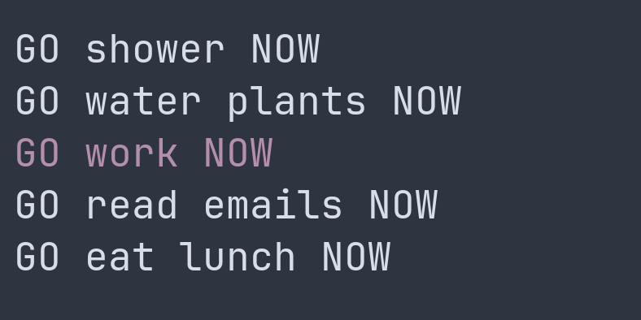

# GO DO NOW
A tui todo list that let you get things done NOW.

(*GO and NOW not included, purple task is the selected/focused task)

## Design
GDN has a minimalistic approach to design, `j`/`k` to navigate up/down, `o` to
add and `d` to delete highlighted task. There is no way to mark a task as done,
once its done its done and should be deleted, never look back!
